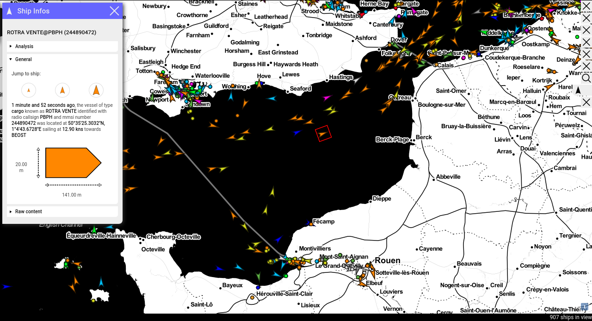

## AIS project

[ais.fractalwire.io/map](http://ais.fractalwire.io/map)

This project uses the [AIS](https://en.wikipedia.org/wiki/Automatic_identification_system) protocol to show the positions of ships around the globe in real-time.

 The  

It is splitted in two submodules:

* A receiver ([ais_back](https://github.com/FractalWire/ais_back)), written in Python and the [Django framework](https://www.djangoproject.com/), that is responsible to store ship informations coming from [aishub.net](aishub.net). It runs on the server-side as a background task.

* The website in itself ([ais_front](https://github.com/FractalWire/ais_front)), written in [Elixir](https://elixir-lang.org/) with the [Phoenix framework](https://www.phoenixframework.org/). It uses the javascript library [Openlayers](https://openlayers.org/) in combination with WebGL to display ship positions on a map.



### About this repository

This repository provides docker files and useful script to run the application in a containarized environment.

#### How to use it

You'll need `docker` installed on your machine for it to work.

First, clone the repository:

```
$ git clone --recurse-submodules https://github.com/FractalWire/ais.git
```

The application can be built for a production or a development environment.

This is controlled with the `ENV` variable set to `prod` or `devel`.

To build the docker containers for a development environment, execute in the root directory of the repository:

```bash
$ ENV=devel script/build_docker.sh
```

Ensure a docker swarm is initialised.

```bash
docker swarm init
```

You can now run the application like so:

```bash
$ ENV=devel script/run_stack.sh
```

On the first run, some docker secrets will be set.

Among other things, you'll be ask to input a valid `aishubapi_username`. If you're not a member of aishub.net with a valid username, you won't be able to display any data.

This is a limitation of the project as we are only working with aishub provider at the moment.

#### Special thanks

To [aishub.net](http://aishub.net), for sharing AIS data for free, making it possible to build fun AIS app at almost no cost.